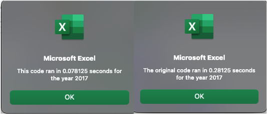

# VBA of Wall Street

## Overview of Project
The purpose of this analysis was to provide Steve with a tool to help him advise his parents on which stocks they should invest in. The macro we built analyzes stock data for 12 companies for 2017 and 2018. We specifically analyzed volume and prices (starting/ending), to determine stock performance.

## Results
### Stock Performance
- Based on the 2017-2018 daily volume and returns, Steve should recommend his parents invest in ENPH and RUN stocks. Of the 12 stock analyzed, these two had positive returns both years and were the top two for daily volume in 2018. Since both of these stocks are peforming well, Steve should recommend investing in both stocks to diversify their portfolio. The market appears to be volatile given that of the 12 stocks, 9 or 75% went from postive returns to negative. 
#### 2017 and 2018 Stock Performance

### Macro Performance
- Refactoring the code reduced the run time from .28 to .08 seconds which is around a 71% decrease. This perfomance boost came form utilizing arrays which allowed the macro to run through the 3000 rows one time and save all the information to the corresponding arrays -- whereas the original macro looped through the 3000 rows 12 times. 
#### Original Code with Nested For Loops
 
    '4. Loop through the tickers.
    For i = 0 To 11
        ticker = tickers(i)
        totalVolume = 0
    
    '5a. Find the total volume for the current ticker.
    
    Worksheets("2018").Activate

        For j = rowStart To lastRow
        
            If Cells(j, 1).Value = ticker Then
            
                totalVolume = totalVolume + Cells(j, 8).Value
                
            End If
            ...
            
        Next j
    ...
    Next i`

#### Refactored Code with Arrays
    `'Initialize array of all tickers
      Dim tickers(12) As String
      ...

    '1a) Create a ticker Index and set to zero
    Dim tickerIndex As Integer
    tickerIndex = 0

    '1b) Create three output arrays for volume, starting, and ending prices
    Dim tickerVolumes(12) As Long
    Dim tickerStartingPrices(12) As Single
    Dim tickerEndingPrices(12) As Single
    ...
  
    '2b) Loop over all the rows in the spreadsheet.
        For i = 2 To RowCount
    
        '3a) Increase volume for current ticker
            If Cells(i, 1).Value = tickers(tickerIndex) Then
                tickerVolumes(tickerIndex) = tickerVolumes(tickerIndex) + Cells(i, 8).Value
                
            End If
        
        '3b) Check if the current row is the first row with the selected tickerIndex. If yes, set starting price.
        If Cells(i, 1).Value = tickers(tickerIndex) And Cells(i - 1, 1) <> tickers(tickerIndex) Then
            tickerStartingPrices(tickerIndex) = Cells(i, 6).Value
              
        End If
        
        '3c) check if the current row is the last row with the selected ticker. If yes, set ending price.
         'If the next row’s ticker doesn’t match, increase the tickerIndex.
        If Cells(i, 1).Value = tickers(tickerIndex) And Cells(i + 1, 1) <> tickers(tickerIndex) Then
            tickerEndingPrices(tickerIndex) = Cells(i, 6).Value
            
            '3d Increase the tickerIndex.
            tickerIndex = tickerIndex + 1
            
        End If
    
    Next i`
* **Code shortened with "..." to show for loops**

#### 2017 Original and Refactored Macro Run Time

## Summary
- The advantages of refactoring is that it gives you the opportunity to not only clean up your code but also make it more concise and efficient. Writing code is similar to drafting an essay. Although your first draft can get the job done, it most likely has errors and might not be concise. Through the editing process, you are able to correct your mistakes and re-word paragraphs to create a more cohesive and stronger essay. Refactoring gives you the same opportunity for your code. Reviewing your code allows you to think about different ways to solve the problem and see if you can find more effiecient approaches. For example, refactoring our macro with output arrays instead of nested loops reduced the runtime by around 71%.

- A disadvantage of refactoring code is that it can be a lenghthy or time consuming process with possibly diminishing returns. Although reducing our stock analysis run time by 71% is impressive, the original macro still only took less than a second to run. However, reducing a macro with an hour runtime by 71% would be more beneficial and much more noticeable. Going back to my essay comparison, spending hours editing a doctoral thesis makes sense whereas spending hours editing a single paragraph does not.
